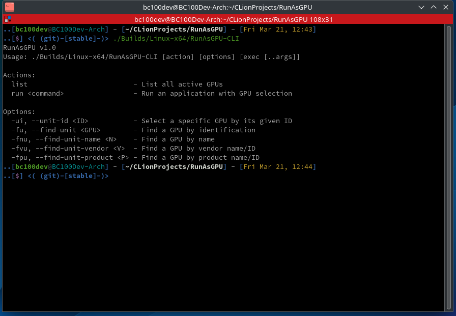
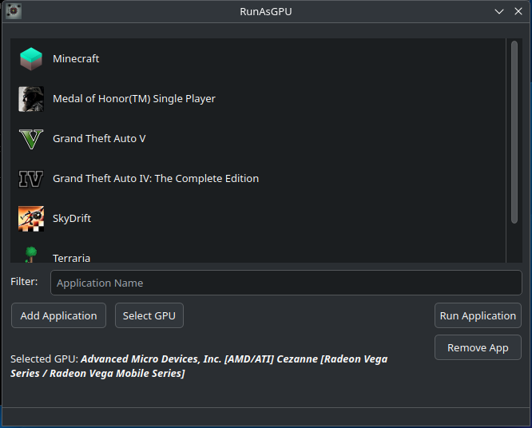

# RunAsGPU

RunAsGPU is a tool designed to give users a simple yet powerful way to control
which GPU an application runs on. This tool was created to overcome limitations
with `DRI_PRIME`, which can sometimes cause issues for users. RunAsGPU provides
both a GUI for easy app selection and a CLI for advanced users.

<p align="center">


</p>

## Features

- GUI Interface – Easily select and manage applications that should run
  on a specific GPU.
- CLI Support – Run applications via terminal with precise GPU selection.
- App List Management – Add and remove apps manually to control GPU
  assignment.
- Automatic GPU Detection – Detects available GPUs and allows switching.
- Lightweight & Fast – No bloat, just a straightforward way to set GPU
  preferences.

## Installation

### Build from Source

#### Dependencies:

- CMake
- Qt6
- GCC or Clang

#### Steps:

```sh
# Clone the repository
git clone https://github.com/BC100Dev/RunAsGPU.git
cd RunAsGPU

# Create build directory
mkdir -p Builds/Linux-x64 && cd Builds/Linux-x64

# Configure and compile
cmake ../../
make -j$(nproc)

# Run the application
./RunAsGPU
```

## Usage

### GUI Mode

1. Open RunAsGPU.
2. Click "Add Application" and select an executable.
3. Choose a GPU to assign to the app.
4. Run the application through the interface.

### CLI Mode

```sh
# List all GPUs
RunAsGPU-CLI list

# Run an application with GPU selection
RunAsGPU-CLI run --unit-id 1 glxinfo

# Find a GPU by Vendor or Product ID
RunAsGPU-CLI run --find-unit 2208 glxinfo
```